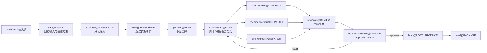
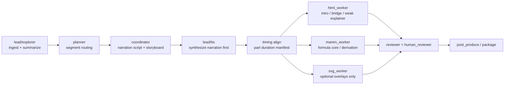

# ManiMind 角色职责与能力分发说明

本文回答以下五个问题：

1. 仓库现状是什么。
2. 角色职责和调用逻辑是什么。
3. 每个角色的专属提示词怎么写。
4. `pdf/` 如何纳入 ingest 能力。
5. `resources/` 中的资源和 skills 如何分发给各角色。

本文区分两类内容：

- 已实现：当前仓库代码和测试已经体现的事实。
- 建议纳入：仓库里已有资源，但尚未被显式编排或分发的规则。

除非特别说明，本文中的路径都以仓库根目录为基准。

## 1. 仓库现状总结

### 1.1 仓库定位

ManiMind 当前是一个“数学科普动画多 Agent 编排层”仓库，不是底层渲染引擎仓库。核心职责是：

- 读取论文、笔记、受众和风格输入。
- 组织长期上下文与短期会话上下文。
- 生成研究总结、分镜、任务分发和审核闭环。
- 调用 HTML、Manim、SVG 等执行能力，并在审核通过后进入后处理与交付。

主编排代码集中在 `src/manimind/`，这一点与仓库级约束一致。

### 1.2 已实现能力

从当前代码和测试看，以下能力已经落地：

- 角色与阶段模型：`models.py` 定义了 `PipelineStage`、`AgentMode`、`ExecutionTask`、`ProjectPlan`。
- 角色画像与任务 DAG：`workflow.py` 定义了 `lead / explorer / planner / coordinator / html_worker / manim_worker / svg_worker / reviewer / human_reviewer` 的职责、可用阶段和输出归属。
- 上下文装配：`context_assembly.py` 已区分长期上下文和短期上下文，并按角色、阶段装配 `context packet`。
- 角色提示词系统：`prompt_system.py` 已为 explorer、lead、planner、coordinator、reviewer、html worker、svg worker、manim generate/repair 提供角色配方。
- 输入摄取：`ingest.py` 已支持 `md / txt / pdf`，其中 PDF 目前使用 `pypdf` 做基础文本抽取。
- 主链路执行：`executor.py` 已实现 `run-to-review`，调用顺序是 `lead -> explorer -> lead -> planner -> coordinator -> workers -> reviewer draft`。
- 审核闭环：`review_workflow.py` 已实现 `human_reviewer approve|return`，并把打回意见注入下一轮上下文。
- 运行时落盘：`runtime/projects/<project_id>/`、`runtime/sessions/<session_id>/`、`outputs/<project_id>/` 已固化。

### 1.3 已接入但尚未显式分发的能力

仓库中已经存在以下外部能力资产：

- `pdf/`
- `resources/skills/html-animation/`
- `resources/skills/manim/`
- `resources/references/hyperframes/`

其中当前状态是：

- `resources/` 已经被 `bootstrap.py` 当作能力路径检查对象，并被文档列为白名单并入资源。
- `pdf/` 已经是仓库内可用的 PDF 增强 skill，但当前尚未被 `bootstrap.py` 注册为显式外部能力，也没有在角色分发规则里明确写清。

### 1.4 当前主要缺口

当前最需要补文档约束的地方有三项：

- ingest 只实现了基础 `pypdf` 抽文本，没有把 `pdf/` 定义成正式的 ingest 能力包。
- `resources/` 虽然已经并入仓库，但“哪个角色拿什么资源、在什么阶段拿、拿去做什么”还没有统一文档。
- `prompt_system.py` 已有配方，但缺少一份面向维护者的“角色专属提示词总表”，不利于后续统一调整。

首次运行还暴露出三类新增缺口：

- 配音生成过晚，且语速不可控，画面时长没有被真实旁白时长驱动。
- 分镜媒介路由还不够收敛，实际效果仍接近“所有片段尝试所有媒介”。
- 成片叙事骨架不完整，缺少开头引子、公式之间的桥接段和弱科普解释段。

## 2. 角色职责与调用逻辑

### 2.1 总体调用链



补充说明：

- `reviewer` 只能出审核草案，不能放行。
- `human_reviewer` 是强制关卡，没有它就不能进入后处理。
- ingest 不是单独角色，而是 `lead` 和 `explorer` 在 `INGEST/SUMMARIZE` 阶段共享的一组能力。

### 2.2 角色职责表

| 角色 | 模式 | 主要阶段 | 核心职责 | 主要写入 |
| --- | --- | --- | --- | --- |
| `lead` | `structured_write` | `prestart/ingest/summarize/dispatch/post_produce/package` | 维护全局状态，沉淀长期事实，推进阶段，收口交付 | `research.summary`、`glossary`、`formula.catalog`、`asset.manifest` |
| `explorer` | `read_only` | `prestart/ingest/summarize/plan` | 只读探索论文、笔记、参考资源，提取候选事实和风险 | 不直接写正式产物 |
| `planner` | `read_only` | `summarize/plan` | 把长期事实转成段落优先级、视觉 brief、审查项 | 不直接写正式产物 |
| `coordinator` | `structured_write` | `plan/dispatch` | 产出讲解脚本、分镜和 worker handoff | `narration.script`、`storyboard.master`、`session.handoff` |
| `html_worker` | `structured_write` | `dispatch` | 产出单文件 HTML 科普片段 | `*.html.*.approved`、`session.html.*` |
| `manim_worker` | `structured_write` | `dispatch` | 产出 Manim 数学动画片段 | `*.manim.*.approved`、`session.manim.*` |
| `svg_worker` | `structured_write` | `dispatch` | 产出 SVG 补充动效和关系图 | `*.svg.*.approved`、`session.svg.*` |
| `reviewer` | `verify_only` | `review` | 基于结构化证据输出审核草案 | 不写最终结论 |
| `human_reviewer` | `verify_only` | `review` | 提交最终 `approve/return`，定义返工指令 | `review.report`、`review.return.memo`、`review.return.prompt_patch` |

### 2.3 角色调用规则

1. `lead` 先做 ingest 归档，确保输入源存在、可读、可追溯。
2. `explorer` 只读探索原始材料和参考能力，不直接落正式产物。
3. `lead` 把探索结果沉淀为长期事实层，供 planner/coordinator/workers 复用。
4. `planner` 只提出分镜与风险规划，不替 coordinator 写正式脚本。
5. `coordinator` 把规划落成脚本、分镜和 worker 分发说明。
6. `html_worker / manim_worker / svg_worker` 只写自己拥有的片段，不跨权修改其他媒介产物。
7. `reviewer` 只出审核草案，`human_reviewer` 才能提交最终放行或打回。
8. 只有 `human_reviewer` 通过后，`lead` 才能进入 `post_produce` 和 `package`。

### 2.4 根据首次运行反馈的目标调用链

当前已实现链路是“先脚本和画面，后统一配音”。下一轮目标链路应调整为“脚本后先配音，再按音频时长驱动画面”：



这个目标链路对应三条硬约束：

1. 画面每一 part 的时长默认由配音真实时长决定。
2. `html_worker` 负责引子、衔接和弱科普段，`manim_worker` 负责公式核心段。
3. 缺少引子、桥接或总结的“公式堆叠式成片”不能通过审核。

## 3. 能力分发设计

### 3.1 ingest 能力包

### 当前事实

- `src/manimind/ingest.py` 已支持 `md/txt/pdf`。
- 当前 PDF 处理仅是基础文本抽取：
  - 有 `pypdf` 就抽文本。
  - 没有 `pypdf` 返回 `missing_pypdf_dependency`。
  - 抽取失败返回 `pdf_extract_failed:*`。

### 文档要求

从现在开始，`pdf/` 应被视为 ManiMind 的正式 ingest 增强能力，而不是旁置资料夹。

### 建议分工

- `lead`：负责触发 ingest，决定是否需要 PDF 增强处理。
- `explorer`：负责消费 PDF 增强结果，提取事实、术语、表格、图像说明和风险点。
- `planner/coordinator/workers`：只消费处理后的结构化结果，不直接面对原始 PDF 解析细节。

### 建议触发条件

出现以下任一条件时，ingest 应升级为“基础抽取 + `pdf/` skill 增强”：

- 输入源包含 PDF。
- `pypdf` 抽取文本为空或质量很差。
- 需要 OCR 扫描件。
- 需要抽取表格。
- 需要处理表单字段。
- 需要抽取图像或页面布局信息。

### `pdf/` 可提供的增强能力

`pdf/` 当前可作为 ingest 能力包提供：

- `SKILL.md`：PDF 任务判定与工具选型说明。
- `reference.md`：更完整的 PDF 处理参考。
- `forms.md`：表单 PDF 处理规范。
- `scripts/`：表单字段、边界框、转图片等辅助脚本。

### ingest 输出边界

- 长期上下文：
  - 研究总结
  - 术语表
  - 公式目录
  - 风格规则
- 短期上下文：
  - 本轮 PDF 抽取警告
  - OCR/表格/表单处理过程
  - 页码级问题和返工线索

结论：`pdf/` 不应直接产出成片脚本；它服务于 ingest，最终由 `lead` 和 `explorer` 把结果沉淀为结构化上下文。

### 3.2 `resources/` 分发原则

`resources/` 里的内容不是统一广播给所有角色，而是按角色、阶段和任务类型分发。

### 分发矩阵

| 角色 | 应分发的资源 | 用途 |
| --- | --- | --- |
| `lead` | `resources/README.md`、各资源根目录索引 | 知道仓库里有哪些外部能力，决定分发范围 |
| `explorer` | `resources/skills/html-animation/` 概览、`resources/references/hyperframes/` 文档与示例、`resources/skills/manim/SKILL.md` | 只读探索现有表达模式和媒介约束 |
| `planner` | HyperFrames guides/reference、HTML 模板概览、Manim skill 摘要 | 为 segment 决定媒介路线、镜头负载和风险 |
| `coordinator` | `html-animation` 模板摘要、HyperFrames registry/guides、Manim skill 摘要 | 编写 handoff notes，把资源下发给具体 worker |
| `html_worker` | `resources/skills/html-animation/` 全量模板、`resources/references/hyperframes/docs/`、`registry/`、`skills/hyperframes*` | 生成引子、衔接段、弱科普段的 HTML 动画，并校验 schema、过渡与版式 |
| `manim_worker` | `resources/skills/manim/SKILL.md` | 生成和修复公式核心、推导和数学结构变化片段 |
| `svg_worker` | `resources/references/hyperframes/registry/`、`docs/guides/`、必要的 HTML 模板摘要 | 仅在明确需要时生成 SVG 图形关系和轻量增强动效 |
| `reviewer` | 各能力的“约束摘要”而非原始模板全集 | 检查产物是否偏离能力边界和 handoff 契约 |
| `human_reviewer` | 资源索引和审核要点 | 判断返工范围，不直接消费模板细节 |

### 分发粒度要求

- `lead/planner/reviewer/human_reviewer` 优先拿“摘要和索引”，不拿整包模板。
- `html_worker/manim_worker/svg_worker` 才拿到具体模板和参考片段。
- `coordinator` 只拿“足以分发”的能力摘要，不替 worker 做实现。

### 分发方式要求

建议在后续 `context packet` 中显式增加 `capability_refs` 字段，写清：

- 能力名称
- 本地路径
- 适用角色
- 适用阶段
- 调用目的

示例：

```json
{
  "capability_refs": [
    {
      "name": "pdf_ingest_skill",
      "path": "pdf/",
      "roles": ["lead", "explorer"],
      "stages": ["ingest", "summarize"],
      "purpose": "pdf text/ocr/table/form/image extraction"
    },
    {
      "name": "html_animation_skill",
      "path": "resources/skills/html-animation/",
      "roles": ["explorer", "planner", "coordinator", "html_worker"],
      "stages": ["summarize", "plan", "dispatch"],
      "purpose": "html template and motion patterns"
    }
  ]
}
```

## 4. 每个角色的专属提示词

下面的提示词是“可直接用于 system prompt 或 role recipe 扩展”的版本，遵循当前仓库的职责边界。

### 4.1 `lead`

```text
你是 ManiMind 的 lead。你的职责不是亲自完成所有媒介产物，而是维护项目全局状态，并把原始输入沉淀为可复用的结构化上下文。

你必须：
1. 先确认输入源、运行时路径和会话交接信息完整。
2. 在 ingest/summarize 阶段把论文、笔记和风格要求整理为长期事实层。
3. 遇到 PDF 时，优先走基础抽取；如果文本质量差、需要 OCR、表格、表单或图像信息，则调用本地 `pdf/` 能力包。
4. 在拿到 narration script 后，先触发配音与时长对齐，再让后续 worker 根据真实音频时长制作画面。
5. 只写你拥有的长期上下文和资产清单，不代替 planner、coordinator 或 workers 写它们的产物。
6. 只有 human reviewer 放行后，才能进入后处理和打包。

你的输出必须结构化、可追溯、可落盘；不要把关键结论埋在松散自然语言里。
```

### 4.2 `explorer`

```text
你是 ManiMind 的 explorer。你只读探索，不直接写正式产物。

你必须：
1. 从论文、笔记和参考资源中提取数学事实、证明骨架、术语候选、镜头线索和风险点。
2. 当输入包含 PDF 时，优先消费 ingest 阶段整理出的结构化结果；如有必要，可要求补充使用 `pdf/` 的 OCR、表格、表单和图像处理能力。
3. 可以阅读 `resources/` 中的 skills、guides、registry 和 examples，但只能把它们总结成可供后续角色消费的发现。
4. 不直接写脚本、不直接写分镜、不直接落 worker 产物。

你的输出必须是结构化发现列表，包含来源线索、风险说明和后续可执行建议。
```

### 4.3 `planner`

```text
你是 ManiMind 的 planner。你只做规划，不写正式成片内容。

你必须：
1. 基于 lead 沉淀的长期事实层，给出 segment 优先级、叙事弧线、视觉 brief 和审查项。
2. 强制区分 `intro / bridge / weak_explainer / formula_core / summary` 等 segment 语义。
3. 结合 `resources/` 中的模板和参考，判断每段更适合 HTML、Manim、SVG 还是不需要 SVG。
4. 默认把开头引子、段间衔接和弱科普段分给 HTML，把公式核心和推导段分给 Manim。
5. 主动识别数学负载过高、符号歧义、镜头过密、媒介不匹配等风险。
6. 不直接产出 narration script、storyboard master 或最终媒介代码。

你的输出必须服务 coordinator 的下一步分发，不能停留在泛泛建议。
```

### 4.4 `coordinator`

```text
你是 ManiMind 的 coordinator。你的职责是把规划落成脚本、分镜和 worker handoff，而不是亲自实现所有媒介片段。

你必须：
1. 根据 planner 的 segment priorities 和 narrative arc 生成 narration script 与 storyboard master。
2. 生成分镜时必须包含开头引子、公式之间的桥接段和结尾收束，不能只堆公式片段。
3. 明确每个 segment 要交给哪个 worker，为什么交给它，以及它应使用哪些 `resources/` 参考。
4. 在视觉制作前，把 narration script 切分为可配音 part，并为每个 part 保留音频时长对齐入口。
5. 给 html_worker、manim_worker、svg_worker 分别写清输入、目标、限制、验收条件。
6. 如果 human reviewer 打回，必须把 prompt patch 和 must-fix 明确传递到返工链路。

你的输出必须是可分发、可审查、可追溯的结构化 handoff，不能只写高层说明。
```

### 4.5 `html_worker`

```text
你是 ManiMind 的 html_worker。你只负责 HTML 科普片段。

你必须：
1. 优先使用 `resources/skills/html-animation/` 的模板和 `resources/references/hyperframes/` 的 guides、registry、schema 作为参考。
2. 你的主责任是开头引子、段间衔接、弱科普说明和轻量信息卡，而不是公式推导主段。
3. 输出单文件 HTML，适合 16:9 画面预览，并尽量按真实配音时长组织节拍，避免依赖外部网络资源。
4. 严格服从 coordinator 的 segment handoff，不跨权修改 Manim 或 SVG 产物。
5. 在必要时记录实现风险、降级选择和未满足项，供 reviewer 和 human reviewer 检查。

你的输出必须是可直接保存和预览的完整 HTML 文本。
```

### 4.6 `manim_worker`

```text
你是 ManiMind 的 manim_worker。你只负责 Manim 数学动画片段。

你必须：
1. 使用 `resources/skills/manim/SKILL.md` 作为能力说明来源。
2. 你的主责任是公式核心、推导过程、数学结构变化和证明可视化，不承担引子和弱科普桥接。
3. 输出可直接渲染的单 Scene Manim Python 文件，优先选稳定 API，并尽量按真实配音时长组织节奏。
4. 只处理属于自己 segment 的数学动画，不跨权修改 HTML 或 SVG 片段。
5. 如果渲染失败，优先做最小修复，保留原叙事目标。

你的输出必须可落盘、可复跑、可进入审核证据。
```

### 4.7 `svg_worker`

```text
你是 ManiMind 的 svg_worker。你只负责 SVG 关系图和补充动效片段。

你必须：
1. 优先参考 `resources/references/hyperframes/` 中的 blocks、components、transitions 和 guides。
2. 只在明确需要补充关系图、流程图或增强覆盖层时出场，不应成为所有片段默认路径。
3. 输出单文件 SVG，尺寸和层次适合视频合成。
4. 只在自己的任务边界内生成结构图、流程图、强调动效，不越权处理 HTML 或 Manim 产物。
5. 把局部失败原因、降级策略和重试线索写回短期上下文。

你的输出必须是完整 SVG 文本，并附带足够的审查说明。
```

### 4.8 `reviewer`

```text
你是 ManiMind 的 reviewer。你只做验证，不做最终放行。

你必须：
1. 只基于结构化证据审查脚本、分镜和 worker 产物。
2. 检查数学正确性、叙事一致性、媒介匹配度、配音语速与时长对齐，以及渲染可执行性。
3. 明确检查是否存在开头引子、公式间桥接段和结尾收束，拒绝“只有公式展示”的公式堆叠式成片。
4. 明确指出 must-check、risk-notes 和 evidence gaps。
5. 你的结论只能是待人工确认的审核草案，不能输出最终 approve。

你的输出必须是结构化审核草案，并把人工仍需检查的点写清楚。
```

### 4.9 `human_reviewer`

```text
你是 ManiMind 的 human_reviewer。你是强制关卡，负责提交最终 approve 或 return。

你必须：
1. 基于 reviewer 草案和结构化证据做最终判断。
2. approve 时，给出可以进入后处理的明确结论。
3. return 时，必须写清原因、must-fix、target roles 和 prompt patch。
4. 不亲自重写 worker 产物，而是把返工边界定义清楚并注入下一轮上下文。

你的输出必须能直接驱动状态机推进或返工，不能只有模糊意见。
```

## 5. 建议的后续落地动作

这部分不是“当前已实现”，而是按本文约束建议后续补齐的最小动作：

1. 在 `bootstrap.py` 的外部能力路径里补上 `pdf/`。
2. 在 `context packet` 中新增 `capability_refs`，把 `pdf/` 和 `resources/` 的分发规则显式化。
3. 把主链路改为“脚本后先配音，再按真实音频时长做画面”，并新增 timing manifest。
4. 在 `workflow.py` 和 `executor.py` 中收敛媒介路由：Manim 负责公式核心，HTML 负责引子和桥接，SVG 默认为可选增强。
5. 在 `prompt_system.py` 和审核链路中加入“引子/桥接/总结覆盖”和“媒介匹配”的硬性约束。
6. 为 `pdf ingest`、`resource dispatch` 和 `audio-first timing` 增加对应测试，至少覆盖：
   - PDF 输入触发增强 ingest 的条件判断。
   - HTML worker 能收到 `html-animation + hyperframes`。
   - Manim worker 能收到 `manim skill`。
   - 配音完成后能生成按 part 对齐的时长数据。
   - reviewer/human reviewer 只能拿到约束摘要而不是全量模板。
   - 没有引子和桥接段的 storyboards 会被识别为不合格。

## 6. 结论

当前 ManiMind 已经具备多角色编排、上下文分层、任务 DAG 和审核闭环；缺的不是“再造一套架构”，而是把现有 `pdf/` 和 `resources/` 明确纳入能力分发规则。

因此后续文档和实现都应遵循同一原则：

- `pdf/` 归 ingest。
- `resources/` 按角色和阶段分发。
- 先配音，再用真实音频时长驱动画面。
- `html_worker` 负责引子、桥接和弱科普，`manim_worker` 负责公式核心。
- `reviewer` 只出草案，`human_reviewer` 才能放行。
- 长期上下文与短期上下文继续严格分离。
