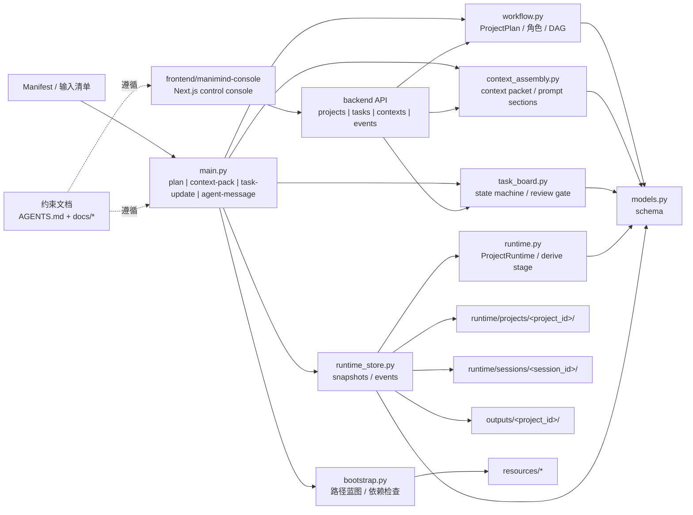

# ManiMind 项目架构设计

本文件描述当前仓库已落地的编排架构，不再只是规划草图。

## 零、官方架构图工件

- `docs/architecture.canvas` 是当前仓库的正式架构白板。
- `src/manimind/` 模块边界、角色分布、状态落盘路径、上下文装配链路、第三方能力接入方式发生变化时，必须在同一次修改中同步更新：
  - `docs/architecture.canvas`
  - `docs/通用项目架构模板.md`
- 当前白板粒度固定为“模块/子系统级”，用于表达编排关系、状态流向与外部能力边界，不追求把每个测试文件都画进去。

## 一、当前架构图



## 二、输入与输出

输入：

- 论文 PDF
- 用户笔记
- 目标受众与风格要求
- 镜头清单 manifest（JSON）

输出：

- 结构化项目计划（含角色、上下文、任务图）
- 角色上下文包与提示词分段
- 任务状态推进记录
- 审核报告与输出资产清单

## 三、架构分层

```text
预启动层
  ├─ 文档与配置加载
  ├─ 运行时依赖检测（resources + tools）
  └─ 路径蓝图生成（runtime/projects, runtime/sessions, outputs）

前端控制台层（frontend/manimind-console/）
  ├─ src/app              App Router 入口与页面壳
  ├─ src/components/console 控制台首页布局与业务卡片
  ├─ src/components/ui    轻量展示组件
  ├─ src/data             mock 数据与后续 API 映射占位
  └─ 只通过 backend API 访问编排状态

编排核心层（src/manimind/）
  ├─ models.py            数据模型：角色、上下文、任务、状态
  ├─ workflow.py          角色编排、上下文蓝图、任务依赖图、审核关卡
  ├─ context_assembly.py  上下文包与提示词分段装配（含缓存）
  ├─ task_board.py        任务状态机（owner/blocker/verification nudge）
  ├─ runtime.py           ProjectRuntime 加载、状态回填与阶段派生
  ├─ runtime_store.py     项目状态、上下文包、任务更新的落盘与日志
  ├─ bootstrap.py         初始化、外部路径检查、参考归档检查
  └─ main.py              CLI 入口（plan/context-pack/task-update/agent-message）

API 层（backend/）
  ├─ main.py              FastAPI 入口
  └─ api/*                projects/tasks/contexts 路由

执行能力层（第三方）
  ├─ resources/skills/html-animation/
  ├─ resources/references/hyperframes/
  └─ resources/skills/manim/SKILL.md
```

## 四、角色架构（已实现）

角色通过 `AgentMode` 三态约束行为：

- `read_only`：只读探索或规划，不允许产物写入
- `structured_write`：允许写入结构化产物，必须遵循归属
- `verify_only`：只输出审核结论，不参与内容生产

默认角色集：

- `lead`
- `explorer`
- `planner`
- `coordinator`
- `html_worker`
- `manim_worker`
- `svg_worker`
- `reviewer`

每个角色都有：

- `allowed_stages`
- `required_inputs`
- `owned_outputs`
- `output_contract`

实现位置：`workflow.build_agent_profiles(...)`。

## 五、状态机与任务图（已实现）

阶段状态机：

```text
PRESTART -> INGEST -> SUMMARIZE -> PLAN -> DISPATCH -> REVIEW -> POST_PRODUCE -> PACKAGE -> DONE
                                                \-> BLOCKED
```

任务级状态机（`ExecutionTask`）：

- 状态：`pending` / `in_progress` / `completed`
- 约束：`blocked_by` 必须全部完成后，任务才可推进
- 所有权：只有 `owner_role` 或 `lead` 可推进任务
- 强制审核：`review.outputs` 为验证关卡，未完成不得进入后处理
- 阻塞表达：`blocked` 通过依赖与事件原因表达，不额外扩充任务状态枚举
- 查询增强（阶段 1 约定）：收到 `worker.blocker` 时，可在任务快照补 `blocked_reason` / `blocked_at`

实现位置：`task_board.list_available_tasks(...)` 与 `task_board.update_execution_task_status(...)`。

## 六、上下文装配（已实现）

上下文记录由 `ContextRecord` 建模，字段包括：

- `scope`（长期/短期）
- `writer_role`
- `consumer_roles`
- `lifecycle`
- `invalidation_rule`
- `sticky`

上下文注入由 `build_context_packet(plan, role_id, stage)` 实现：

- 按角色模式 + 角色必需输入选择上下文
- 返回统一 `constraints` 与 `write_targets`
- 可选渲染提示词分段（`PromptSectionCache`）

静态/动态双态载体（阶段 1 基线）：

- 静态上下文：项目级稳定事实与已批准条目，适合沉淀到 `runtime/projects/<project_id>/`
- 动态上下文：按角色、阶段、会话装配的运行时材料，适合沉淀到 `runtime/sessions/<session_id>/`
- 提升链路：子 Agent 先回写动态材料，再由 leader 提交为静态事实或阶段推进
- 进度写入（阶段 1 约定）：`worker.progress` 默认只追加到会话级 `events.jsonl`，不生成独立 progress 文件

## 七、CLI 接口（已实现）

- `plan <manifest>`：构建完整项目计划
- `context-pack <manifest> <role_id> <stage>`：输出角色上下文包
- `context-pack ... --render-prompt-sections`：输出提示词分段
- `task-update <manifest> <task_id> <status> <actor_role>`：按状态机推进任务
- `agent-message <manifest> <event_type> <role_id> <stage>`：写入 `worker.progress` / `worker.blocker` / `worker.result` / `review.decision`
- 三个命令均支持 `--session-id`，并会把结果落盘到 `runtime/projects/...` 与 `runtime/sessions/...`

## 八、与 ClaudeCode 的关系

- `ClaudeCode/` 只保留为可选参考归档，不是运行时依赖。
- 已抽取并固化到 ManiMind 的能力：
  - 角色模式化编排
  - 上下文分段装配与缓存
  - 任务依赖状态机与验证关卡

对应清单见 [ClaudeCode抽取清单.md](./ClaudeCode抽取清单.md)。
