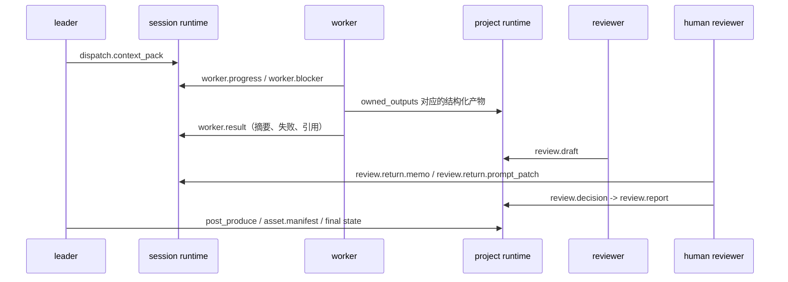

# ManiMind 阶段 1 计划

## 一、阶段定位

阶段 1 的目标不是尽快接入更多生成器，而是把多 Agent 协作底座定型为“可控、可追溯、可审核”的编排系统。

本阶段至少完成三件事：

- 定稿项目级状态机与任务级状态机。
- 定稿上下文的静态/动态两种存储方式。
- 定稿 leader 与子 Agent 的结构化通讯链路。

本阶段明确不做：

- 不把重点放在 PDF 解析、论文抽取器、真实渲染执行器。
- 不优先做 Web 控制台、异步队列或微服务拆分。
- 不允许绕过人工确认型 reviewer 直接进入后处理。

## 二、阶段产物

阶段 1 完成后，仓库应具备以下可交付设计基线：

- 一份稳定的阶段状态机定义。
- 一份稳定的任务状态推进规则。
- 一套静态上下文与动态上下文的落盘约定。
- 一条 leader、worker、reviewer 之间可回放的通讯链路。
- 一组能映射到 `src/manimind/` 现有模块的职责边界。
- 一套可直接落到 `events.jsonl` 的事件类型约定。

## 三、状态机设计

### 3.1 项目级阶段状态机

目标阶段流保持为：

```text
PRESTART -> INGEST -> SUMMARIZE -> PLAN -> DISPATCH -> REVIEW -> POST_PRODUCE -> PACKAGE -> DONE
                                   \-> BLOCKED
```

其中：

- `BLOCKED` 是覆盖态，不是线性主路径中的常驻节点。
- `REVIEW` 是强制关卡，未通过不得进入 `POST_PRODUCE`。
- `PACKAGE` 表示交付包、资产索引和导出清单已经封口，随后才能进入 `DONE`。
- 阶段 1 允许 `INGEST`、`SUMMARIZE`、`PLAN`、`DISPATCH`、`REVIEW`、`POST_PRODUCE` 进入 `BLOCKED`。
- 阶段 1 不要求实现独立的“阻塞任务状态枚举”，而是把 `BLOCKED` 视为项目阶段的覆盖态。

### 3.2 阶段进入/退出条件

| 阶段 | 进入条件 | 退出条件 | 主写入者 |
|:---|:---|:---|:---|
| `PRESTART` | 项目刚创建，仅有 manifest 与约束文档 | 归档输入后进入 `INGEST` | `lead` |
| `INGEST` | 输入源开始归档 | `session.handoff` 完成并确认输入可用 | `lead` |
| `SUMMARIZE` | 研究总结开始生成 | `research.summary`、`glossary`、`formula.catalog` 完成 | `lead` |
| `PLAN` | 讲解脚本与分镜开始规划 | `narration.script`、`storyboard.master`、任务分发表完成 | `coordinator` |
| `DISPATCH` | 子任务开始执行 | 所有要求进入审核的片段任务完成或被明确阻塞 | `coordinator` / 子 Agent |
| `REVIEW` | `review.outputs` 开始审核 | AI reviewer 产出草案，且人工 reviewer 明确确认放行或打回 | `reviewer` + `human_reviewer` |
| `POST_PRODUCE` | 审核放行，开始后处理 | 配音、字幕、拼接、资产汇总完成 | `lead` |
| `PACKAGE` | 输出清单与交付包封口 | leader 写入最终完成标记 | `lead` |
| `DONE` | 所有交付物可追溯且已封版 | 无 | `lead` |

`BLOCKED` 的进入/退出规则：

| 覆盖阶段 | 进入条件 | 退出条件 | 恢复目标 |
|:---|:---|:---|:---|
| `BLOCKED` | 当前活跃阶段收到未自愈的 `worker.blocker`，或人工 reviewer 打回，且需要外部补输入/人工裁决 | leader 补齐输入、接受重试建议，或人工 reviewer 解除阻塞 | 回到阻塞前的活跃阶段，并按最新任务可执行集重新派生 |

阶段 1 对 `BLOCKED` 的约束：

- `BLOCKED` 只声明项目态语义，不新增独立任务状态枚举。
- 解除阻塞后，项目阶段由 leader 提交 `unblock` 事件，再重新计算当前活跃阶段。
- 若阻塞源来自人工 reviewer，则只能由新的 `review.decision` 或 leader 明确的重新派审动作解除。

### 3.3 任务级状态机

阶段 1 保持任务状态最小集合：

```text
pending -> in_progress -> completed
```

设计决定：

- 不为任务单独引入 `blocked` 状态，阻塞由 `blocked_by` 和事件原因表达。
- 只有 `owner_role` 或 `lead` 可以推进任务状态。
- `review.outputs` 必须作为验证关卡存在，不能被普通渲染任务绕开。
- `review.outputs` 只有在人工 reviewer 明确确认后才能进入 `completed`；AI reviewer 的草案不等于放行。
- 任一任务若依赖未满足，不得进入 `in_progress` 或 `completed`。
- 收到 `worker.blocker` 后，任务可以暂时维持 `in_progress`，但查询视图必须补充阻塞元数据，避免与“正常执行中”混淆。
- `POST_PRODUCE` 与 `PACKAGE` 必须映射为两个独立任务，避免一个任务跨两个阶段。

推荐的运行时扩展字段：

- `blocked_reason`
- `blocked_at`
- `last_progress`
- `last_progress_at`

这些字段的用途是增强查询与审计视图，不改变 `TaskStatus` 的最小枚举。

### 3.4 状态机与事件的关系

状态机只定义“当前事实”，事件流负责解释“为什么变成这样”。

- `execution-tasks.json` 保存任务最新状态。
- `state.json` 保存项目当前阶段。
- `events.jsonl` 保存迁移原因、操作者、时间戳与引用路径。
- `execution-tasks.json` 允许出现查询增强字段，如 `blocked_reason` 或 `last_progress`。

这意味着：

- 状态文件用于读取当前事实。
- 事件文件用于追查历史与回放链路。

## 四、上下文的静态/动态两种存储方式

### 4.1 设计原则

上下文必须同时按两条轴线管理：

- 生命周期：长期项目级 / 短期会话级
- 载体形态：静态上下文 / 动态上下文

这里的“静态/动态”不等于“只读/可写”：

- 静态上下文：某一时刻被确认可复用、可被引用的稳定事实。
- 动态上下文：围绕某个角色、阶段、会话临时装配或追加的运行时材料。

### 4.2 双态存储矩阵

| 维度 | 静态上下文 | 动态上下文 |
|:---|:---|:---|
| 项目级 | `research.summary`、`glossary`、`formula.catalog`、`style.guide`、`storyboard.master`、`review.report` 等稳定条目 | `state.json`、`execution-tasks.json`、`project-plan.json`、`events.jsonl` 反映运行中状态与变化轨迹 |
| 会话级 | 当前会话固定交接结论，如 `session.handoff` 的 pinned 版本 | `context-packets/*.json`、`task-updates/*.json`、局部失败记录、重试痕迹、最近一次上下文快照 |

### 4.3 物理载体

长期项目级目录：

```text
runtime/projects/<project_id>/
```

短期会话级目录：

```text
runtime/sessions/<session_id>/
```

阶段 1 对物理载体的约定如下：

- 静态项目上下文以结构化条目注册到 `context-records.json`，并由项目级快照引用。
- 动态项目状态以 `state.json`、`execution-tasks.json`、`project-plan.json`、`events.jsonl` 保存。
- 动态会话上下文以 `context-packets/*.json`、`task-updates/*.json` 与 `*-latest.json` 保存。
- 阶段 1 不额外引入隐式缓存目录作为事实源；缓存只能是派生物，不能反向覆盖静态上下文。

### 4.4 静态与动态之间的提升规则

静态/动态不是两套彼此独立的世界，而是有明确提升链路：

1. leader 根据项目静态上下文与当前动态状态，装配角色级 `context packet`。
2. 子 Agent 在会话侧写入动态结果、失败原因和局部说明。
3. 若结果符合 `owned_outputs` 与 `output_contract`，对应角色可写入其拥有的结构化产物。
4. leader 负责把“会话动态材料”汇总成“项目静态事实”或阶段推进动作。
5. reviewer 只消费结构化产物与可追溯上下文，不直接消费未确认的口头说明。

### 4.6 人工打回的上下文与 prompt 注入设计

`review.report` 的语义调整为：

- 只保存人工确认后的正式审核结论
- 不再承载 AI reviewer 的中间草案

人工打回时新增两类会话级动态材料：

1. `review.return.memo`
   - 作用：保存人工打回意见原文、目标任务、影响产物、优先级
   - 建议写入者：`human_reviewer`
   - 建议消费者：`lead`、`coordinator`、`reviewer`、目标 worker
   - 建议生命周期：`session`
   - 建议失效规则：`next_review_round`
2. `review.return.prompt_patch`
   - 作用：保存可直接注入下一轮执行提示词的返工指令
   - 内容应聚焦“必须修改什么、不得改什么、验收口径是什么”

建议物理位置：

```text
runtime/sessions/<session_id>/review-returns/
```

建议注入规则：

1. 如果打回的是讲解逻辑、分镜结构、叙事口径，注入 `coordinator` 的下一轮 `context packet`
2. 如果打回的是具体媒介片段质量，注入对应 `html_worker` / `manim_worker` / `svg_worker` 的下一轮 `context packet`
3. 如果打回的是全局数学事实、术语或风格问题，同时注入 `coordinator` 与受影响 worker

建议 prompt 植入位置：

1. `role` 段之后
2. `context` 段之前

也就是把“人工打回指令”作为独立高优先级段，而不是埋入普通 summary。推荐顺序：

```text
role
human_review_feedback
context
output
guardrails
```

### 4.5 治理字段

每个静态上下文条目必须继续保留以下治理字段：

- `writer_role`
- `consumer_roles`
- `lifecycle`
- `invalidation_rule`
- `sticky`

动态上下文至少要补齐以下元数据：

- `session_id`
- `task_id`
- `from_role`
- `stage`
- `source_context_keys`
- `created_at`

若动态上下文用于表达阻塞或进度，还应优先补齐：

- `message_type`
- `blocked_reason`
- `progress_label`
- `attempt_index`

## 五、leader 与子 Agent 的通讯链路

### 5.1 总体原则

阶段 1 的通讯不依赖“聊天记忆”，而依赖结构化 runtime：

- leader 维护全局状态与阶段推进。
- 子 Agent 只通过结构化上下文包收任务、回写结果和声明阻塞。
- AI reviewer 只在证据齐全时生成审核草案，最终放行或打回由人工 reviewer 确认。

### 5.2 通讯载体

不新增独立消息中间件，优先复用现有文件型 runtime：

- leader 下发：`runtime/sessions/<session_id>/context-packets/*.json`
- 协作快照：`runtime/sessions/<session_id>/context-pack-latest.json`
- 状态推进：`runtime/sessions/<session_id>/task-updates/*.json`
- 全局审计：项目级与会话级 `events.jsonl`
- 长期结果：`runtime/projects/<project_id>/` 与 `outputs/<project_id>/`

### 5.3 标准消息类型

阶段 1 统一约定七类消息语义：

| 消息类型 | 发送方 | 接收方 | 作用 |
|:---|:---|:---|:---|
| `dispatch.context_pack` | `lead` / `coordinator` | 子 Agent | 下发任务、上下文、写入边界 |
| `worker.progress` | 子 Agent | `lead` | 反馈执行进度，不改全局状态 |
| `worker.blocker` | 子 Agent | `lead` | 声明阻塞原因、缺失输入或重试建议 |
| `worker.result` | 子 Agent | `lead` / `reviewer` | 回传结构化产物引用与摘要 |
| `review.draft` | `reviewer` | `lead` / `human_reviewer` | 生成审核草案、待人工确认 |
| `review.decision` | `human_reviewer` | `lead` | 给出最终放行或打回结论 |
| `leader.commit` | `lead` | runtime | 提交阶段切换、任务状态、资产索引 |

代码侧事件类型基线：

- `plan_snapshot`
- `dispatch.context_pack`
- `worker.progress`
- `worker.blocker`
- `worker.result`
- `review.draft`
- `review.decision`
- `leader.commit`
- `stage.changed`

消息落盘策略：

- `dispatch.context_pack`：写入 `context-packets/*.json`，并刷新 `context-pack-latest.json`。
- `worker.progress`：只追加到会话级 `events.jsonl`，不单独生成 `progress/*.json` 文件。
- `worker.blocker`：追加到项目级与会话级 `events.jsonl`，并回写任务查询增强字段 `blocked_reason` / `blocked_at`。
- `worker.result`：回写结构化产物引用，并在会话级 `events.jsonl` 记录摘要。
- `review.draft`：回写待人工确认的审核草案，不推动 `review.outputs` 完成。
- `review.decision`：回写人工最终审核结论；若为打回，同时写入 `review.return.memo` 与可选 `review.return.prompt_patch`。
- `leader.commit`：负责把运行时变更提交到 `state.json`、`execution-tasks.json`、`project-plan.json`。

`worker.progress` 的频率约束：

- 阶段 1 不追求高频心跳。
- 同一 `task_id` 默认只记录“开始 / 关键里程碑 / 结束前摘要”三类进度事件。
- 单个 attempt 建议不超过 5 条 progress 事件，避免 `runtime/sessions/` 无上限膨胀。

### 5.4 标准链路



### 5.5 链路中的职责边界

- leader 可以读取所有状态，但不能替代子 Agent 生成所有媒体细节。
- 子 Agent 可以写入其 `owned_outputs`，但不能直接改 `current_stage`。
- reviewer 不能生产正式媒体产物，只能输出审核草案。
- `human_reviewer` 才能给出最终放行或打回结论。
- 任何“只在自然语言里说完成了，但没有结构化落盘”的结果都视为未完成。

### 5.6 `manim-worker-pov/` 的定位

- `manim-worker-pov/` 是独立的 worker 侧原型，用于验证固定 spec 下的 Manim 生成、渲染和日志修复闭环。
- 它不是 `src/manimind/` 编排主路径的一部分，也不是运行时硬依赖。
- 阶段 1 可以把它当作 worker 协议验证样本，但不能把它误写成已经接入 leader/runtime 的正式执行器。

## 六、与现有模块的映射

阶段 1 不新增核心模块，直接依托现有编排层：

- `models.py`：保持 `TaskStatus` 最小枚举；如需要表达阻塞原因或最近进度，应优先补运行时快照字段，而不是先扩状态枚举。
- `models.py`：同时定义 `ExecutionTask.stage` 与 `EventType`，避免阶段推导和事件语义散落在字符串常量里。
- `workflow.py`：定义角色、上下文蓝图与任务 DAG。
- `context_assembly.py`：从静态上下文与动态状态生成 `context packet`。
- `task_board.py`：执行 owner / blocker / review gate。
- `runtime.py`：统一加载 runtime 并派生阶段。
- `runtime_store.py`：写入静态快照、动态上下文包、任务更新与审计事件。
- `main.py` / `backend/`：暴露 `plan`、`context-pack`、`task-update`，并新增 `agent-message` / `POST /api/projects/events/message` 用于写入结构化协作消息。

## 七、里程碑与验收

### 7.1 里程碑

1. 冻结阶段/任务状态机术语。
2. 冻结静态/动态上下文载体和路径规则。
3. 冻结 leader-子 Agent-reviewer 的消息语义与载体。
4. 用一个最小项目清单跑通 `plan -> context-pack -> task-update -> review -> package` 的可追溯链路。

最小验收 fixture：

- 配置文件：[`configs/stage1-golden-path.example.json`](../configs/stage1-golden-path.example.json)
- 设计目标：只生成 2 个 render task（1 个 HTML、1 个 Manim），避免把验收样例做成多模态大项目。
- 预期链路：`ingest.sources -> summarize.research -> plan.storyboard -> render.seg-html.html -> render.seg-manim.manim -> review.outputs -> post_produce.outputs -> package.delivery`

### 7.2 验收标准

- 能解释任意时刻项目为什么处于当前阶段。
- 能解释任一子任务读了哪些上下文、写了哪些结果。
- 能区分哪些内容是静态事实，哪些只是会话内动态材料。
- 能证明 reviewer 没有被跳过。
- 能从 `runtime/projects/<project_id>/` 与 `runtime/sessions/<session_id>/` 回放一次完整协作链路。

## 八、当前风险与后续动作

当前文档层面已经能把阶段 1 的核心设计定型，但实现上仍有两个需要继续收口的点：

- `worker.progress`、`worker.blocker`、`worker.result` 已接入 runtime 与 CLI/API 链路，但还没有完全接入真实渲染执行器。
- `manim-worker-pov/` 当前仍是独立 POC；若要作为正式验收样本，还需要补齐向 session runtime 的结构化回写。
- 人工确认型 reviewer 还未接入现有 CLI/API/runtime 设计，当前 `review.outputs` 仍偏自动占位。

后续建议优先顺序：

1. 先按本计划统一阶段语义与事件名。
2. 再固化人工打回的 session 动态记录格式与 prompt 注入顺序。
3. 然后接入真实执行器。
4. 最后补控制台人工审核界面。
